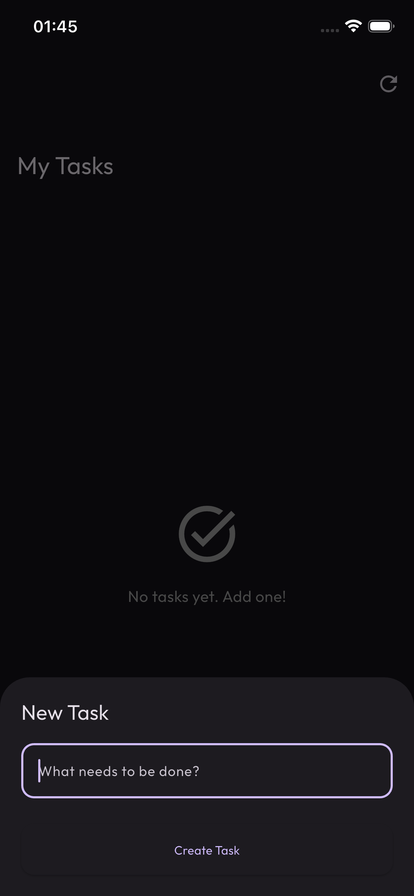
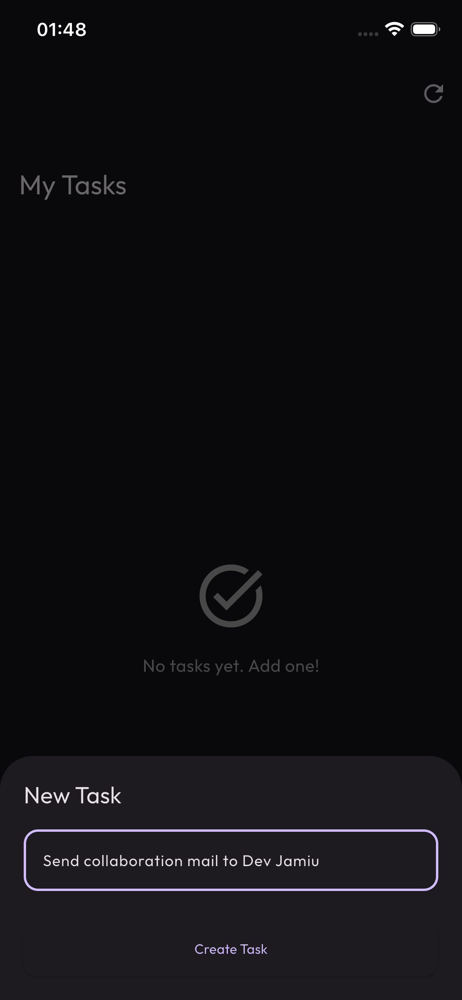
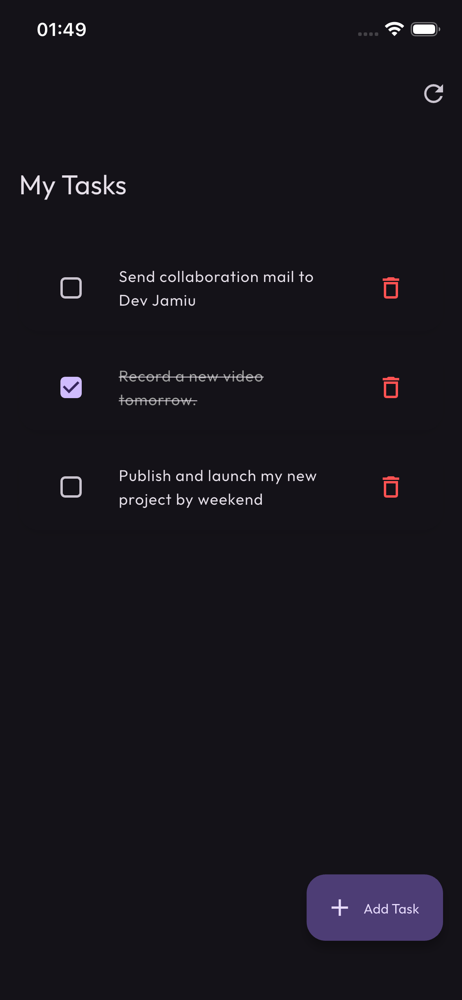

# Dart Frog Full Course Tutorial

[![style: dart frog lint][dart_frog_lint_badge]][dart_frog_lint_link]
[![License: MIT][license_badge]][license_link]
[](https://dart-frog.dev)
[](https://youtube.com/techwithsam)
[](https://globe.dev/) [](https://flutter.dev)
[](https://github.com/techwithsam/fintech_todo_serverpod)
[](https://github.com/techwithsam)

A comprehensive tutorial project demonstrating how to build a RESTful API backend using [Dart Frog](https://dart-frog.dev), a fast and minimalistic backend framework for Dart.

[Full Course] Full-Stack Flutter in 2026: Dart Frog Full Course Tutorial - [Watch on youtube](https://www.youtube.com/playlist?list=PLMfrNHAjWCoBnALAfJAFvCmonUiBURAly)

<a href="https://youtu.be/9rGEQH05x4I?si=lRIEztHczEpbAFrj"> </a>

## 📋 Table of Contents

- [Features](#-features)
- [Prerequisites](#-prerequisites)
- [Getting Started](#-getting-started)
- [Project Structure](#-project-structure)
- [API Endpoints](#-api-endpoints)
- [Development](#-development)
- [Flutter Frontend Integration](#-flutter-frontend-integration)
- [Testing](#-testing)
- [License](#-license)

## ✨ Features

- **RESTful API** with CRUD operations
- **Todo Management System** with create, read, update, and delete functionality
- **User Management** endpoints
- **Authentication** with JWT and BCrypt
- **Middleware Support** for logging, CORS, and authentication
- **In-memory data storage** for learning purposes
- **Clean architecture** with repository pattern
- **Comprehensive test coverage**
- **Hot reload** for rapid development

## 🔧 Prerequisites

Before you begin, ensure you have the following installed:

- [Dart SDK](https://dart.dev/get-dart) (>=3.0.0)
- [Dart Frog CLI](https://dart-frog.dev/docs/overview#installing)

Install Dart Frog CLI:

```bash
dart pub global activate dart_frog_cli
```

## 🚀 Getting Started

1. **Clone the repository:**

```bash
git clone https://github.com/techwithsam/dart_frog_full_course_tutorial
cd dart_frog_full_course_tutorial
```

1. **Install dependencies:**

```bash
dart pub get
```

1. **Start the development server:**

```bash
dart_frog dev
```

The server will start on `http://localhost:8080`.

## 📁 Project Structure

```
my_project/
├── lib/
│   └── src/
│       ├── constant.dart         # Constants (JWT Secret)
│       ├── todo_model.dart       # Todo data model
│       ├── todo_repository.dart  # Todo data access layer
│       ├── user_model.dart       # User data model
│       └── user_repository.dart  # User data access layer
├── routes/
│   ├── index.dart                # Root endpoint (GET /)
│   ├── auth/
│   │   ├── login.dart            # User login (POST /auth/login)
│   │   └── register.dart         # User registration (POST /auth/register)
│   ├── todos/
│   │   ├── _middleware.dart      # Middleware (Auth, CORS, Logging)
│   │   ├── index.dart            # Todo list operations (GET, POST /todos)
│   │   └── [id].dart             # Individual todo operations (GET, PUT, DELETE /todos/:id)
│   └── users/
│       └── index.dart            # User operations (GET, POST /users)
├── test/
│   └── routes/
│       └── index_test.dart       # Route tests
├── analysis_options.yaml         # Dart analyzer configuration
├── pubspec.yaml                  # Project dependencies
└── README.md                     # This file
```

## 🌐 API Endpoints

### Root

#### GET /

Returns a welcome message.

**Response:**

```json
{
  "message": "Hello Flutter World from Dart Frog! 🐸"
}
```

---

### Auth

#### POST /auth/register

Register a new user.

**Request Body:**

```json
{
  "username": "user1",
  "password": "password123"
}
```

**Response:**

```json
{
  "id": "uuid",
  "username": "user1"
}
```

#### POST /auth/login

Login and receive a JWT.

**Request Body:**

```json
{
  "username": "user1",
  "password": "password123"
}
```

**Response:**

```json
{
  "token": "eyJhbGciOiJIUz..."
}
```

---

### Todos

> **Note:** All `/todos` endpoints look for a valid JWT in the `Authorization` header: `Bearer <token>`.

#### GET /todos

Retrieve all todos.

**Response:**

```json
[
  {
    "id": "1",
    "title": "Learn Dart Frog",
    "isCompleted": false
  }
]
```

#### POST /todos

Create a new todo.

**Request Body:**

```json
{
  "title": "My new todo"
}
```

**Response:**

```
Status: 201 Created
Body: "Todo created"
```

#### GET /todos/:id

Retrieve a specific todo by ID.

**Response:**

```json
{
  "id": "1",
  "title": "Learn Dart Frog",
  "isCompleted": false
}
```

#### PUT /todos/:id

Update a todo.

**Request Body:**

```json
{
  "title": "Updated title",
  "isCompleted": true
}
```

**Response:**

```json
{
  "id": "1",
  "title": "Updated title",
  "isCompleted": true
}
```

#### DELETE /todos/:id

Delete a todo.

**Response:**

```
Status: 204 No Content
```

---

### Users

#### GET /users

Retrieve all users.

**Response:**

```json
[
  { "id": 1, "name": "Alice" },
  { "id": 2, "name": "Bob" },
  { "id": 3, "name": "Charlie" }
]
```

#### POST /users

Create a new user.

**Request Body:**

```json
{
  "name": "David"
}
```

**Response:**

```json
{
  "id": 4,
  "name": "David"
}
```

---

## 💻 Development

### Running in Development Mode

```bash
dart_frog dev
```

This starts the server with hot reload enabled. Changes to your code will automatically reload the server.

### Building for Production

```bash
dart_frog build
```

This creates a production-ready build in the `build` directory.

### Running the Production Build

```bash
dart build/bin/server.dart
```

## 📱 Flutter Frontend Integration

This Dart Frog backend can be easily connected to a Flutter frontend application. The `flutter_todo_dart_frog` directory contains a complete Flutter app example that demonstrates how to interact with this API.

### Connecting Your Flutter App

1. **Update your API base URL:**

In your Flutter app's HTTP client configuration, set the base URL to your Dart Frog server:

```dart
const String apiBaseUrl = 'http://localhost:8080';
```

1. **Make HTTP requests:**

```dart
import 'package:http/http.dart' as http;

// Get all todos
Future<List<Todo>> fetchTodos() async {
  final response = await http.get(
    Uri.parse('$apiBaseUrl/todos'),
  );
  
  if (response.statusCode == 200) {
    final List<dynamic> jsonData = jsonDecode(response.body);
    return jsonData.map((json) => Todo.fromJson(json)).toList();
  } else {
    throw Exception('Failed to load todos');
  }
}

// Create a new todo
Future<void> createTodo(String title) async {
  final response = await http.post(
    Uri.parse('$apiBaseUrl/todos'),
    headers: {'Content-Type': 'application/json'},
    body: jsonEncode({'title': title}),
  );
  
  if (response.statusCode != 201) {
    throw Exception('Failed to create todo');
  }
}

// Update a todo
Future<void> updateTodo(String id, String title, bool isCompleted) async {
  final response = await http.put(
    Uri.parse('$apiBaseUrl/todos/$id'),
    headers: {'Content-Type': 'application/json'},
    body: jsonEncode({
      'title': title,
      'isCompleted': isCompleted,
    }),
  );
  
  if (response.statusCode != 200) {
    throw Exception('Failed to update todo');
  }
}

// Delete a todo
Future<void> deleteTodo(String id) async {
  final response = await http.delete(
    Uri.parse('$apiBaseUrl/todos/$id'),
  );
  
  if (response.statusCode != 204) {
    throw Exception('Failed to delete todo');
  }
}
```

1. **Handle network requests:**

For production environments, update your API URL to point to your deployed server:

```dart
const String apiBaseUrl = 'https://your-production-url.com';
```

### Screenshots

The Flutter frontend integrating with this Dart Frog backend:

## Screenshots

|             App Screenshot            |             App Screenshot           |             App Screenshot           |
| :----------------------------------: | :----------------------------------: | :----------------------------------: |
|  |  |  |

## 🧪 Testing

Run all tests:

```bash
dart test
```

Run tests with coverage:

```bash
dart test --coverage=coverage
dart pub global activate coverage
dart pub global run coverage:format_coverage --lcov --in=coverage --out=coverage/lcov.info --report-on=lib
```

## 📝 Learning Resources

- [Dart Frog Documentation](https://dart-frog.dev/docs)
- [Dart Language Tour](https://dart.dev/guides/language/language-tour)
- [REST API Best Practices](https://restfulapi.net/)

## 🤝 Contributing

Contributions are welcome! Please feel free to submit a Pull Request.

## 📄 License

This project is licensed under the MIT License - see the [LICENSE](LICENSE) file for details.

[dart_frog_lint_badge]: https://img.shields.io/badge/style-dart_frog_lint-1DF9D2.svg
[dart_frog_lint_link]: https://pub.dev/packages/dart_frog_lint
[license_badge]: https://img.shields.io/badge/license-MIT-blue.svg
[license_link]: https://opensource.org/licenses/MIT
